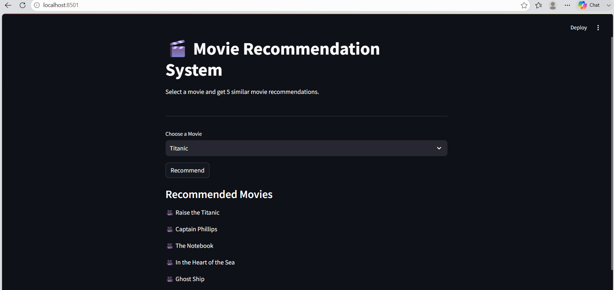

#  Movie Recommendation System

A Content-Based Movie Recommendation System built using **Machine Learning** that recommends similar movies based on the movie selected by the user.

The recommendation engine uses **CountVectorizer** and **Cosine Similarity** to identify movies with similar content.

---

##  Project Overview

This project recommends the **Top 5 similar movies** based on the selected movie.

Instead of using user ratings, this system analyzes movie content such as:

- Genres
- Keywords
- Cast
- Director
- Movie Overview

These features are combined into a single text representation and compared using Cosine Similarity.

---

##  Features

-  Recommend Top 5 Similar Movies
-  Content-Based Recommendation
-  Data Cleaning & Feature Engineering
-  Machine Learning Recommendation Engine
-  Saved Model using Pickle
-  Interactive Streamlit Web Application

---

##  Streamlit Application

<p align="center">
    
</p>

---

##  Tech Stack

- Python
- Pandas
- NumPy
- Scikit-learn
- Streamlit
- Pickle

---

##  Machine Learning Concepts Used

- Content-Based Recommendation System
- Feature Engineering
- CountVectorizer
- Cosine Similarity

---

##  Project Structure

```text
Movie Recommendation System
│
├── app
│   ├── app.py
│   └── recommend.py
│
├── assets
│   └── home.png
│
├── data
│   ├── tmdb_5000_movies.csv
│   └── tmdb_5000_credits.csv
│
├── models
│   ├── movie_list.pkl
│   └── similarity.pkl
│
├── notebooks
│   ├── 01_Data_Preparation.ipynb
│   ├── 02_Feature_Engineering.ipynb
│   └── 03_Model_Building.ipynb
│
├── README.md
├── requirements.txt
├── LICENSE
└── .gitignore
```

---

##  Dataset

Dataset Used:

**TMDB 5000 Movie Dataset**

Contains:

- Movie Information
- Genres
- Keywords
- Cast
- Crew
- Overview

---

##  Installation

Clone the repository

```bash
git clone https://github.com/your-username/Movie-Recommendation-System.git
```

Go to project directory

```bash
cd Movie-Recommendation-System
```

Create virtual environment

```bash
python -m venv .venv
```

Activate virtual environment

Windows

```bash
.venv\Scripts\activate
```

Install dependencies

```bash
pip install -r requirements.txt
```

---

##  Run the Application

```bash
streamlit run app/app.py
```

---

##  Workflow

1. Load Dataset
2. Merge Movies & Credits Dataset
3. Perform Feature Engineering
4. Create Tags Column
5. Convert Text into Vectors
6. Calculate Cosine Similarity
7. Recommend Top 5 Similar Movies
8. Display Results using Streamlit

---

##  Sample Output

**Input**

```
Avatar
```

**Output**

```
Titan A.E.
Aliens vs Predator: Requiem
Small Soldiers
Battle: Los Angeles
Falcon Rising
```

---

##  Future Improvements

- Display Movie Posters using TMDB API
- Add Movie Ratings
- Add Search Suggestions
- Deploy on Streamlit Cloud
- Improve Recommendation Accuracy using TF-IDF

---

##  Author

**Vinita Patil**

- GitHub: https://github.com/VinitaPatil2005
- LinkedIn: https://www.linkedin.com/in/vinita-patil-a87052303/

---
